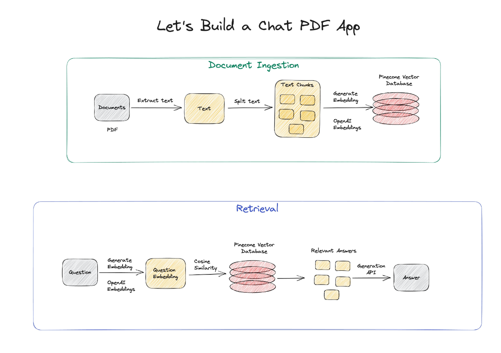
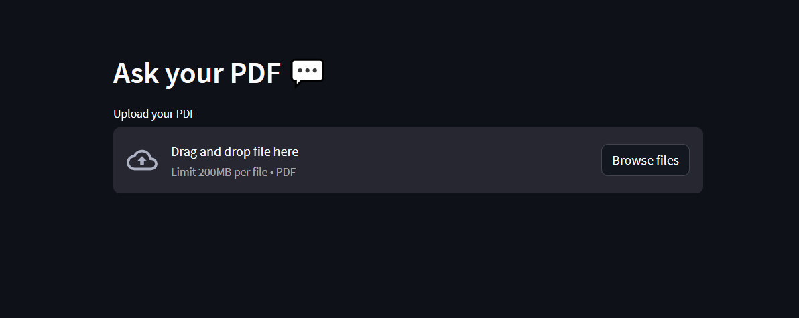
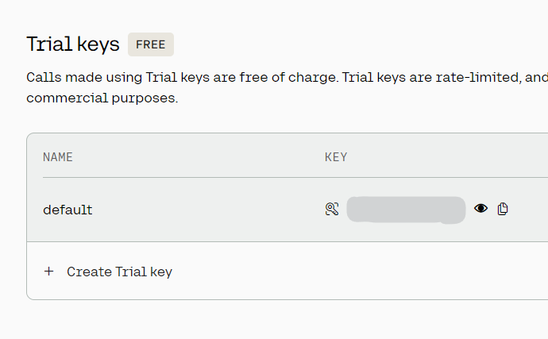
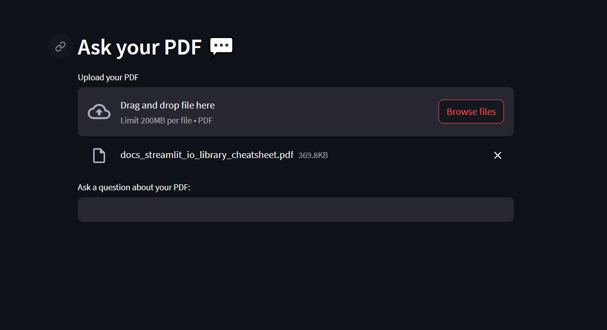

# Chat with PDF

**Objective :**

To Create a Web to interact with your Documents

**Prerequisites :**

- Basic Python
- Streamlit
- Basic Knowledge about LLM’s

**Available Products:**

- [chatpdf.com](https://www.chatpdf.com/)



**Procedure :**

1. Create Your Basic Streamlit app
```python
import streamlit as st
def main():

    st.set_page_config(page_title="Ask your PDF")
    st.header("Ask your PDF 💬")
    pdf = st.file_uploader("Upload your PDF", type="pdf")

if __name__ == '__main__':
    main()
```
Screenshots:

2. Create your API Key
    1. OpenAI
    2. Cohere
    3. Hugging Faces
    
For this Example We will go with Cohere
    
**Screenshots**


3. Import Libraries for Embeddings, Vector Storage, PDF reading
```python
from PyPDF2 import PdfReader
from langchain.text_splitter import CharacterTextSplitter
from langchain.embeddings import CohereEmbeddings
from langchain.vectorstores import FAISS
from langchain.chains.question_answering import load_qa_chain
from langchain.llms import Cohere
```
4. Create a Text Splitter for the Content from PDF
```python
if pdf is not None:
      pdf_reader = PdfReader(pdf)
      text = ""
      for page in pdf_reader.pages:
        text += page.extract_text()
        

      text_splitter = CharacterTextSplitter(
        separator="\n",
        chunk_size=1000,
        chunk_overlap=200,
        length_function=len
      )
      chunks = text_splitter.split_text(text)
```
5. Create Embedding For the Splitted Text
```python
embeddings = CohereEmbeddings(cohere_api_key="YOUR API KEY")
```
6. Store the Embedded data in Vector Storage using FAISS
```python
knowledge_base = FAISS.from_texts(chunks, embeddings)
```
7. Create the Streamlit Component to Chat with your PDF
```python
user_question = st.text_input("Ask a question about your PDF:")
```
Screenshots:

8. Process the the user input using the cohere LLM and the Data stored in Vector Storage
```python
if user_question:
        docs = knowledge_base.similarity_search(user_question)
        
        llm = Cohere(cohere_api_key="YOUR API KEY", temperature=0.5)

        chain = load_qa_chain(llm, chain_type="stuff")
        response = chain.run(input_documents=docs, question=user_question)
           
        st.write(response)
```
NOTE :

- Remember to Change “YOUR API KEY ” with your Respective API Keys
- Remember to install cohere , faiss python package
```bash
pip install cohere faiss-cpu
```

