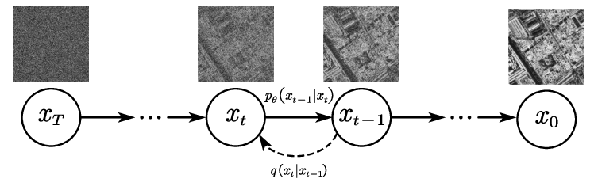

# Backward Diffusion

As the name tells, the backward diffusion is complete reverse way of forward diffusion. It removes all the noise from a noisy image.
Through Forward and Backward Diffusion, the model learns to analyse and identify images.

