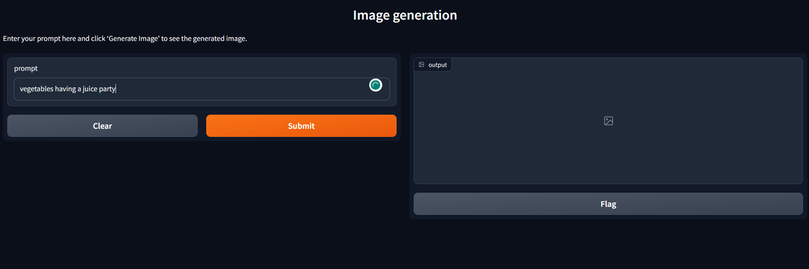

# Creating an Image Generation Application using Clipdrop API and Gradio

Gradio enables the creation and sharing of demos in Python with just a few lines of code. It provides the capability to host webpages and potentially generate revenue. This documentation outlines the process of building an image generation application using the Clipdrop API and Gradio.

## Gradio Tutorial

To get started, follow these steps:

1. Install the Gradio library by running the command:

```
pip install gradio
```

2. Use the following code as a template:
```python
import gradio as gr

def greet(name):
    return "Hello " + name + "!"

demo = gr.Interface(fn=greet, inputs="text", outputs="text")

demo.launch()
```
This code snippet creates a basic Gradio application that accepts user input and displays a greeting.

## Image Generation Application
To create an image generation application using the Clipdrop API and Gradio, use the code below:

```python
import gradio as gr
import requests
import io
from PIL import Image

def generate_image(prompt):
    r = requests.post('https://clipdrop-api.co/text-to-image/v1',
        files={
            'prompt': (None, prompt, 'text/plain')
        },
        headers={'x-api-key': 'YOUR API KEY HERE'}
    )

    if r.ok:
        images = Image.open(io.BytesIO(r.content))
        return images
    else:
        raise ValueError("Failed to generate image")

iface = gr.Interface(
    fn=generate_image,
    inputs=gr.inputs.Textbox(),
    outputs=gr.outputs.Image(type="pil"),
    title="Image generation",
    description="Enter your prompt here and click 'Generate Image' to see the generated image.",
)

if __name__ == "__main__":
    iface.launch()


```
This code demonstrates how to utilize the Clipdrop API to generate images based on a user's input prompt. The Gradio interface takes care of user interaction and image display. Replace **'YOUR API KEY HERE'** with your actual Clipdrop API key.

Feel free to modify and expand upon this example to suit your specific image generation needs.

```

gradio app.py

```

Use the above command to run the program.

**Output**


### Thank You!