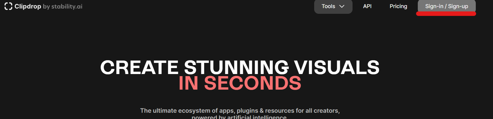

# What is ClipDrop?

ClipDrop.co is a cutting-edge platform that harnesses the power of generative artificial intelligence to revolutionize visual content creation. By seamlessly integrating advanced AI algorithms with intuitive user interfaces, ClipDrop.co empowers users to effortlessly transform ideas into reality. Whether it's generating stunning artwork, realistic scenes, or intricate designs, this platform opens up a realm of creative possibilities, enabling individuals to transcend traditional limitations and explore new frontiers in digital expression.

## Create an account at Clipdrop.co

Clipdrop is a generative AI that contains a text-to-image generator with open source API available. Refer the clipdrop docs for more information.

After signing up, Click **API** and generate your own API.
*Do not share your API key to anyone or any public source*

**Kudos!** Now you have your clipdrop API key generated and received free 100 credits.

Click on **reveal api key** and copy it to your clip board.
*If your api key is leaked to public by change, do **revoke** it and generate a new one*

### *With 100 credits, you can generate 200 images*

