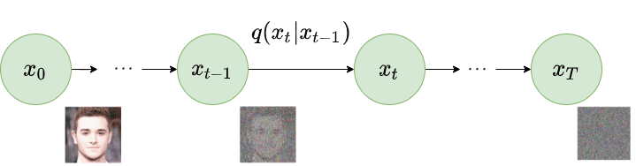

# Forward Diffusion

In the “Forward Diffusion” process, we slowly and iteratively add noise to (corrupt) the images in our training set such that they “move out or move away” from their existing subspace. At the end of the forward diffusion stage xT, due to the iterative addition of noise, we are left with a (pure) noisy image representing an “Isotropic Gaussian.”

