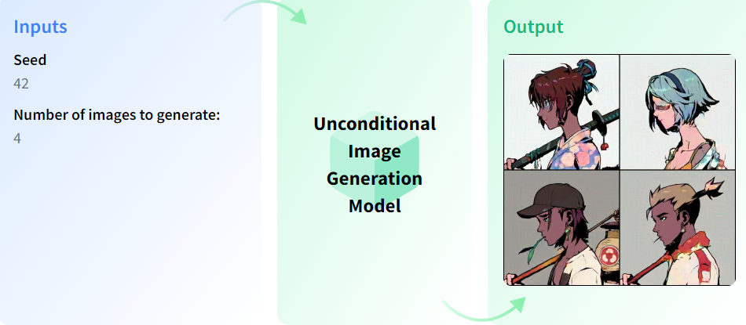

# Image Generation

Image Generation is the task of generating new images from an existing dataset. It is a part of Generative AI that also uses diffusion models to generate images in various ways.

There are two kinds of image generation models:
- Conditional Generation
- Unconditional Generation

## Unconditional Generation

Unconditional image generation is the task of generating images with no condition in any context (like a prompt text or another image). Once trained, the model will create images that resemble its training data distribution.

## Conditional Generation

Conditional image generation allows you to generate images from a text prompt. The text is converted into embeddings which are used to condition the model to generate an image from noise.

- Text to Image
- Text-guided image to image
- Text-guided image-inpainting
- Image to image

### Few of the commonly used, top Image Generators used on the internet:

- Dall-e2
- Midjourney
- DreamStudio by Stable Diffusion
- Bing Image Generator
- Clipdrop
- Google’s Imagen
- Canva Image Generator
