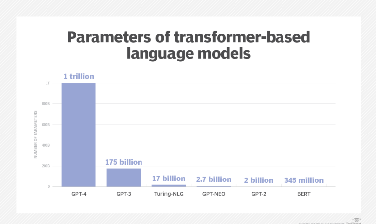
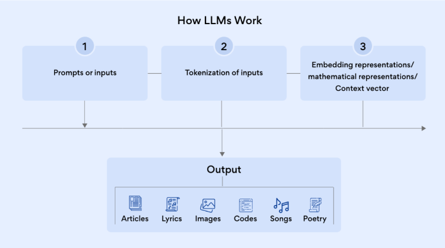

# Introduction

Language is at the core of all forms of human and technological communications; it provides the words, semantics and grammar needed to convey ideas and concepts. In the AI world, a language model serves a similar purpose providing a basis to communicate and generate new concepts.

A large language model (LLM) is a type of artificial intelligence (AI) algorithm that uses deep learning techniques and massively large data sets to understand, summarize, generate and predict new content. The term generative AI also is closely connected with LLMs, which are, in fact, a type of generative AI that has been specifically architected to help generate text-based content.

Natural language processing (NLP) in simple terms refers to giving computers the ability to understand text and spoken words in much the same way human beings can.Language models are commonly used in natural language processing (NLP) applications where a user inputs a query in natural language to generate a result. NLP is a broader field than LLM, which consists of algorithms and techniques.

An LLM is the evolution of the language model concept in AI that dramatically expands the data used for training and inference. In turn, it provides a massive increase in the capabilities of the AI model. As you know ,an LLM needs huge amounts of data sets to be trained ,which in
itself would contain a lot of parameters. Parameters are a machine learning term for the internal variables of the model that are learned during the training process and represent the knowledge the model has acquired.Parameters are the .The quality of a language model depends on its
size, the amount and diversity of data it was trained on, and the complexity of the learning algorithms used during training.

# Working

In the first step, the LLM needs to be trained on a large volume.The training can take multiple steps, usually starting with an unsupervised learning approach. Unstructured data refers to information that lacks a predefined data model or organized structure. This type of data is often more complex and challenging to process and analyze using traditional methods (example: sensor data). The benefit of training on unlabeled data is that there is often vastly more data available. At this stage, the model begins to derive relationships between different words
and concepts.

Step two calls for training and fine-tuning in the form of self-supervised learning. Self-supervised learning for language models (LLM) is a way of training a computer program to understand and generate human-like language without the need for explicit human-labeled examples. In simple terms we give it a lot of text from the internet or other sources. The model learns to predict missing parts of the text, like guessing the next word in a sentence or filling in the blanks. By doing this, the model starts to learn the underlying patterns and relationships in the language.

In step three the LLM tries to understand and recognize the relationships and connections between words and concepts using a self-attention mechanism. Instead of focusing on the whole content, the model breaks it into individual parts and tokens. Tokens can be words, characters, subwords, or symbols, depending on the type and the size of the model. Tokenization is the process of splitting the input and output texts into smaller units that can be processed by the LLM AI models. Tokenization can help the model to handle different languages, vocabularies,
and formats, and to reduce the computational and memory costs.OpenAI uses a subword tokenization method called "Byte-Pair Encoding (BPE)" for its GPT-based models. BPE is a method that merges the most frequently occurring pairs of characters or bytes into a single token, until a certain number of tokens or a vocabulary size is
reached.

**Applications Of LLM**

- Text generation. The ability to generate text on any topic that the
LLM has been trained on is a primary use case.
- Translation. For LLMs trained in multiple languages, the ability to
translate from one language to another is a common feature.
- Content summary. Summarizing blocks or multiple pages of text is
a useful function of LLMs.
- Rewriting content. Rewriting a section of text is another capability.
- Classification and categorization. An LLM is able to classify and
categorize content.
- Sentiment analysis. Most LLMs can be used for sentiment analysis
to help users to better understand the intent of a piece of content or
a particular response.

- Conversational AI and chatbots. LLMs can enable a conversation
with a user in a way that is typically more natural than older
generations of AI technologies.

**Future**

Today, chatbots based on LLMs are most commonly used "out of the box" as a text-based, web-chat interface. They’re used in search engines such as Google’s Bard and Microsoft’s Bing (based on ChatGPT) and for automated
online customer assistance.The next generation of LLMs will not likely be artificial general intelligence or sentient in any sense of the word, but they will continuously improve and get "smarter."

LLMs will continue to be trained on ever larger sets of data, and that data will increasingly be better filtered for accuracy and potential bias. It's also likely that LLMs of the future will do a better job than the current generation when it comes to providing attribution and better explanations for how a given result was generated.
