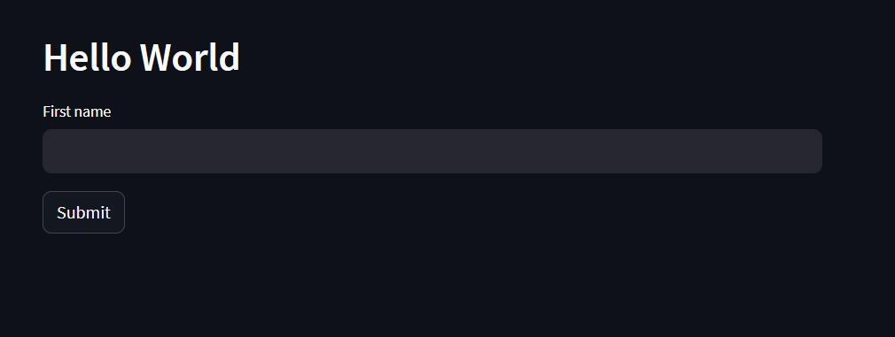

# Streamlit

**What is Streamlit ?**

Streamlit is an open source framework in Python language.

It helps us create web apps for data science and machine learning in a short time

**Benefits Of Streamlit**

- Fully Open Source
- No prior knowledge required about traditional front -end development
- Fully written in python

**Prerequisites**

- Knowledge about Python

**Procedure**

1. Install Streamlit
```bash
pip install streamlit
```
2. Create a python file app.py

3. import Streamlit
```bash
import streamlit as st
```
4. Type your basic code to show the header
```python
st.header("Hello World ")
```
5. Run your basic app
    1. open terminal in the current directory
    2. use the command below to  run your streamlit app

```bash
streamlit run app.py
```
Screenshot:


6. Create a Text Entry Box and a button
```python
userin = st.text_input('First name')
st.button("Submit")
```
Screenshot:

7. Add a Functionality on submit
```python
def hello():
    st.text(userin)
st.button("Submit",on_click=hello())
```
Screenshot:
C:\Users\akank\docusorus\docusaurus-yt-example\docs\streamlit\base4.png

**Streamlit Resources :**

- Streamlit Documentation : https://docs.streamlit.io/
- Streamlit Cheatsheet : https://docs.streamlit.io/library/cheatsheet

